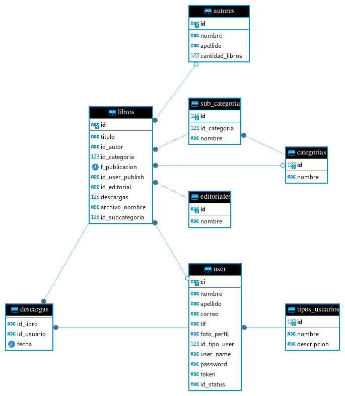

# Tablas para la base de datos ede padel 

+ el sistema esta realizado con le motor de base de datos postgresql en casod e adaptarlo a otro motor de base de datos deberia de cambiar las sentencias sql paara adaptarlo de igual forma se le anexa una diagrama de entidad rela el cual debe seguir rigurosamente 


```sql
-- public.autores definition

-- Drop table

-- DROP TABLE public.autores;

CREATE TABLE public.autores (
	id varchar NOT NULL,
	nombre varchar NOT NULL,
	apellido varchar NOT NULL,
	cantidad_libros int4 NULL DEFAULT 0,
	CONSTRAINT autores_pk PRIMARY KEY (id)
);

-- Permissions

ALTER TABLE public.autores OWNER TO desarrollo;
GRANT ALL ON TABLE public.autores TO desarrollo;


-- public.categorias definition

-- Drop table

-- DROP TABLE public.categorias;

CREATE TABLE public.categorias (
	id int4 NOT NULL,
	nombre varchar NULL,
	CONSTRAINT categorias_pk PRIMARY KEY (id)
);

-- Permissions

ALTER TABLE public.categorias OWNER TO desarrollo;
GRANT ALL ON TABLE public.categorias TO desarrollo;


-- public.editoriales definition

-- Drop table

-- DROP TABLE public.editoriales;

CREATE TABLE public.editoriales (
	id varchar NOT NULL,
	nombre varchar NOT NULL,
	CONSTRAINT editoriales_pk PRIMARY KEY (id)
);

-- Permissions

ALTER TABLE public.editoriales OWNER TO desarrollo;
GRANT ALL ON TABLE public.editoriales TO desarrollo;


-- public.tipos_usuarios definition

-- Drop table

-- DROP TABLE public.tipos_usuarios;

CREATE TABLE public.tipos_usuarios (
	id int4 NOT NULL,
	nombre varchar NOT NULL,
	descripcion varchar NULL,
	CONSTRAINT tipos_usuarios_pk PRIMARY KEY (id)
);

-- Permissions

ALTER TABLE public.tipos_usuarios OWNER TO desarrollo;
GRANT ALL ON TABLE public.tipos_usuarios TO desarrollo;


-- public.sub_categoria definition

-- Drop table

-- DROP TABLE public.sub_categoria;

CREATE TABLE public.sub_categoria (
	id_categoria int4 NOT NULL,
	id int4 NOT NULL,
	nombre varchar NOT NULL,
	CONSTRAINT sub_categoria_pk PRIMARY KEY (id),
	CONSTRAINT sub_categoria_fk FOREIGN KEY (id_categoria) REFERENCES public.categorias(id)
);

-- Permissions

ALTER TABLE public.sub_categoria OWNER TO desarrollo;
GRANT ALL ON TABLE public.sub_categoria TO desarrollo;


-- public."user" definition

-- Drop table

-- DROP TABLE public."user";

CREATE TABLE public."user" (
	ci varchar NOT NULL,
	nombre varchar NULL,
	apellido varchar NULL,
	correo varchar NULL,
	tlf varchar NULL,
	foto_perfil varchar NULL,
	id_tipo_user int4 NOT NULL,
	user_name varchar NOT NULL,
	"password" varchar NOT NULL,
	"token" varchar NULL,
	id_status varchar NOT NULL,
	CONSTRAINT user_pk PRIMARY KEY (ci),
	CONSTRAINT user_fk FOREIGN KEY (id_tipo_user) REFERENCES public.tipos_usuarios(id)
);

-- Permissions

ALTER TABLE public."user" OWNER TO desarrollo;
GRANT ALL ON TABLE public."user" TO desarrollo;


-- public.libros definition

-- Drop table

-- DROP TABLE public.libros;

CREATE TABLE public.libros (
	id varchar NOT NULL,
	titulo varchar NOT NULL,
	id_autor varchar NULL,
	id_categoria int4 NULL,
	f_publicacion timestamp NOT NULL,
	id_user_publish varchar NULL,
	id_editorial varchar NOT NULL,
	descargas int8 NULL,
	archivo_nombre varchar NOT NULL,
	id_subcategoria int4 NOT NULL DEFAULT 0,
	CONSTRAINT libros_pk PRIMARY KEY (id),
	CONSTRAINT libros_un UNIQUE (archivo_nombre),
	CONSTRAINT libros_fk_autor FOREIGN KEY (id_autor) REFERENCES public.autores(id),
	CONSTRAINT libros_fk_categorias FOREIGN KEY (id_categoria) REFERENCES public.categorias(id),
	CONSTRAINT libros_fk_editorial FOREIGN KEY (id_editorial) REFERENCES public.editoriales(id),
	CONSTRAINT libros_fk_subcategoria FOREIGN KEY (id_subcategoria) REFERENCES public.sub_categoria(id),
	CONSTRAINT libros_fk_user_publish FOREIGN KEY (id_user_publish) REFERENCES public."user"(ci)
);

-- Permissions

ALTER TABLE public.libros OWNER TO desarrollo;
GRANT ALL ON TABLE public.libros TO desarrollo;


-- public.descargas definition

-- Drop table

-- DROP TABLE public.descargas;

CREATE TABLE public.descargas (
	id_libro varchar NOT NULL,
	id_usuario varchar NOT NULL,
	fecha timestamp NOT NULL,
	CONSTRAINT descargas_fk FOREIGN KEY (id_libro) REFERENCES public.libros(id),
	CONSTRAINT descargas_fk_usuarios FOREIGN KEY (id_usuario) REFERENCES public."user"(ci)
);

-- Permissions

ALTER TABLE public.descargas OWNER TO desarrollo;
GRANT ALL ON TABLE public.descargas TO desarrollo;
```

